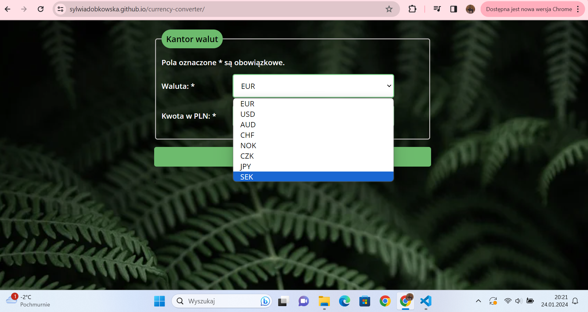

# Currency Converter
 ## About project
 This project is a simple currency converter which allows you to quickly convert polish zlotys to other currencies based on exchange rate manually established in the code. It was made as a homework quest for the frontend developer course I am currently doing. The website can be found in the following link: https://sylwiadobkowska.github.io/currency-converter/

 User chooses one of possible currencies on a list. 
 
 
 Then the user puts in the amount in PLN that they want to convert. 
  
  
 The result appears under the form field after clicking the button.
  
 
 
 
## Currencies available
Right now there are following currencies to choose from:
- Euro (EUR)
- United States Dollar (USD)
- Australian Dollar (AUD)
- Swiss Franc (CHF)
- Norwegian Krone (NOK)
- Czech Koruna (CZK)
- Japanese Yen (JPY)
- Swedish Krona (SEK)

## Technologies
The projest was created using following technologies:
- JavaScript
- HTML
- CSS

## Files
This repository consists of following files:
- `index.html` : Main HTML file for the Currency Converter website.
- `script.js` : JS file responsible for the calculating interaction.
- `style.css`, `container.css`, `form.css` : Files containing styling of the form.
